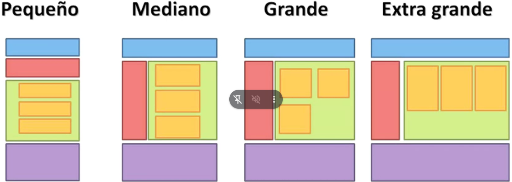

# Crear Componentes Frontend

## Tabla de Contenido

[1. Primera Sesión](#1-primera-sesión)

[2. Segunda Sesión](#segunda-sesión)

[3. Tercera Sesión](#tercera-sesión)


---

## Primera Sesión

1. Se hace un repaso de CSS y se pide hacer una maquetación

2. Se pide hacer aplicación de flexbox y copiar la empresa de laika con HTML y CSS

---

Muy posiblemente mañana miremos un frameworks


## Segunda Sesión | Bootstrap

> Clase del 21/04/2026


*Imagen Tomada De: https://www.theknowledgeacademy.com/blog/what-is-bootstrap/*

> A partir de ahora mis apuntes seran mi opinion que cosas que tomo del componente formativo / PDF acerca de Bootstrap.

Ideas Principales:

* Se nos recuerda la separación de dos tipos de abstracción para una aplicación web: Frontend y Backend

* El frontend es la parte que interactua con el usuario en donde el backend es lo que procesa la información del usuario y devolverá una respuesta para que el frontend responda mostrandole al usuario una interfaz.

Por la parte del **Frontend*: HTML, CSS, JAVASCRIPT

Por la parte del **Backend*: Servidor y Base de Datos, SQL

Bootstrap es un framework que inicio con un proyecto de twitter en respuesta a resolver un problema de la epoca. Se libero como un proyecto open en 2011.

* Se encuentra facilmente en: https://github.com/twbs/bootstrap

> Bonito mirar las stars y la cantidad de contribuidores. 

El framework o marco de trabajo hara más facil la programación y el diseño, pero se pueden perder ciertas libertades o quedar sometido al diseño.

Un framework como bootstrap le interesa adaptarse a la aplicación web y poder estar facilmente en varios dispositivos como smartphones, tabletas, pc, mobile.

* Por esta razón se piensa en mobile first siendo una metodologia de diseño que inicialmente se presenta en movil por lo que primero se programa esto, primero. Y ahí si despues la versión desktop.

**Primeros Pasos con Bootstrap: https://getbootstrap.com/docs/5.3/getting-started/introduction/**

> A continuación mis razonamientos en orden.

1. El dominio que tiene es interesante y estoy en una carpeta /docs/ según el link

2. Se crea una estructura HTML5

2. Se inserta el código de Bootstrap CSS y el JS teniendo en si los links que vinculan al código que esta en la nube.

```html
    <!doctype html>
    <html lang="en">
    <head>
        <meta charset="utf-8">
        <meta name="viewport" content="width=device-width, initial-scale=1">
        <title>Bootstrap demo</title>
        <link href="https://cdn.jsdelivr.net/npm/bootstrap@5.3.8/dist/css/bootstrap.min.css" rel="stylesheet" integrity="sha384-sRIl4kxILFvY47J16cr9ZwB07vP4J8+LH7qKQnuqkuIAvNWLzeN8tE5YBujZqJLB" crossorigin="anonymous">
    </head>
    <body>
        <h1>Hello, world!</h1>
        <script src="https://cdn.jsdelivr.net/npm/bootstrap@5.3.8/dist/js/bootstrap.bundle.min.js" integrity="sha384-FKyoEForCGlyvwx9Hj09JcYn3nv7wiPVlz7YYwJrWVcXK/BmnVDxM+D2scQbITxI" crossorigin="anonymous"></script>
    </body>
    </html>
```

3. Es opcional, pero se puede incorporar un "Poopper" o Separador que consiste en ingresar el siguente código:

```html
    <script src="https://cdn.jsdelivr.net/npm/@popperjs/core@2.11.8/dist/umd/popper.min.js" integrity="sha384-I7E8VVD/ismYTF4hNIPjVp/Zjvgyol6VFvRkX/vR+Vc4jQkC+hVqc2pM8ODewa9r" crossorigin="anonymous"></script>
    <script src="https://cdn.jsdelivr.net/npm/bootstrap@5.3.8/dist/js/bootstrap.min.js" integrity="sha384-G/EV+4j2dNv+tEPo3++6LCgdCROaejBqfUeNjuKAiuXbjrxilcCdDz6ZAVfHWe1Y" crossorigin="anonymous"></script>
```

Despues como segunda lectura recomendada:

Voy entendiendo que se busca maquetación extremadamente rápida, procura ser responsive, componentes tiene un fuerte en GRID y se debe tener conocimiento de HTML y CSS para utilizarlo.

Se comenta entonces una instalación

la cual seria: **[https://getbootstrap.com/docs/5.3/getting-started/download/](https://getbootstrap.com/docs/5.3/getting-started/download/ "https://getbootstrap.com/docs/5.3/getting-started/download/")**

> Su descripción es: Download Bootstrap to get the compiled CSS and JavaScript, source code, or include it with your favorite package managers like npm, RubyGems, and more.

* Creo la carpeta **bootstrap-5.3.8-dist**: contiene muchos archivos CSS y JS

Me pareció interesante que la carpeta que se utilizo para descargar bootstrap me trajo unas hojas de estilos con demasiados estilos ya escritos y lo que falta es utilizar esas clases para editar el HTML de una forma sencilla y muy rápida.

Es chevere y siento que es facil, aunque me parece raro porque implica una nueva forma de pensamiento al momento de programar.

* Se pide descargar bootstrap, cortar y pegar las carpetas CSS, JS y crear una carpeta img y el archivo .html.

> Le cambie nombre a la carpeta que descargué.

Ingreso al archivo index.html de mi proyecto en bootstrap y que inserte el comand ! y haga un link a la hoja de estilo bootstrap.css

> El código de bootstrap.css llega a 12.040 lineas de código.

* Ahora se pide insertar lo siguente:

En este caso continuaremos manual. Lo primero es ir a la página de Bootstrap

donde está la documentación: [https://getbootstrap.com/docs/5.1/getting-started/introduction/](https://getbootstrap.com/docs/5.1/getting-started/introduction/ "https://getbootstrap.com/docs/5.1/getting-started/introduction/") y copie la línea de código sombreada:

```html
<link href="https://cdn.jsdelivr.net/npm/bootstrap@5.1.3/dist/css/bootstrap.min.css" rel="stylesheet" integrity="sha384-1BmE4kWBq78iYhFldvKuhfTAU6auU8tT94WrHftjDbrCEXSU1oBoqyl2QvZ6jIW3" crossorigin="anonymous">
```

Se pide vincular más la carpeta por lo que:

```html
<!DOCTYPE html>
<html lang="es">
<head>
    <meta charset="UTF-8">
    <meta http-equiv="X-UA-Compatible" content="IE=edge">
    <meta name="viewport" content="width=device-width, initial-scale=1.0">
    <title>Document</title>
    <link rel="stylesheet" type="text/css" href="css/bootstrap.css">
</head>
<body>
    

    <script src="js/bootstrap.bundle.min.js"></script>
    <script src="js/popper.min.js"></script>
    <script src="js/bootstrap.min.js"></script>
</body>
</html>
```

> A este punto ya se ha instalado el framework.

Es interesante mirar: [**https://getbootstrap.com/**](https://getbootstrap.com/ "https://getbootstrap.com/")

Todos estos pasos fueron la instalación manual de bootstrap.

Tambien se pueden utilizar las hojas de estilo que estan libres y host en un server de internet:

Y se comenta que el mismo bootstrap te deja el código para copiar en tu index si lo vas a usar y por ende revise el siguente link: [*https://getbootstrap.com/docs/5.3/getting-started/introduction/*](https://getbootstrap.com/docs/5.3/getting-started/introduction/ "https://getbootstrap.com/docs/5.3/getting-started/introduction/")

```html
<!doctype html>
<html lang="en">
    <head>
        <meta charset="utf-8">
        <meta name="viewport" content="width=device-width, initial-scale=1">
        <title>Bootstrap demo</title>
        <link href="https://cdn.jsdelivr.net/npm/bootstrap@5.3.8/dist/css/bootstrap.min.css" rel="stylesheet" integrity="sha384-sRIl4kxILFvY47J16cr9ZwB07vP4J8+LH7qKQnuqkuIAvNWLzeN8tE5YBujZqJLB" crossorigin="anonymous">
    </head>
    <body>
        <h1>Hello, world!</h1>
        <script src="https://cdn.jsdelivr.net/npm/bootstrap@5.3.8/dist/js/bootstrap.bundle.min.js" integrity="sha384-FKyoEForCGlyvwx9Hj09JcYn3nv7wiPVlz7YYwJrWVcXK/BmnVDxM+D2scQbITxI" crossorigin="anonymous"></script>
    </body>
        <script src="https://cdn.jsdelivr.net/npm/@popperjs/core@2.11.8/dist/umd/popper.min.js" integrity="sha384-I7E8VVD/ismYTF4hNIPjVp/Zjvgyol6VFvRkX/vR+Vc4jQkC+hVqc2pM8ODewa9r" crossorigin="anonymous"></script>
        <script src="https://cdn.jsdelivr.net/npm/bootstrap@5.3.8/dist/js/bootstrap.min.js" integrity="sha384-G/EV+4j2dNv+tEPo3++6LCgdCROaejBqfUeNjuKAiuXbjrxilcCdDz6ZAVfHWe1Y" crossorigin="anonymous"></script>
</html>
```

Entonces aprendí dos formas nuevas de instalación con bootstrap, una local y la otra por medio de internet.

Ahora, ¿Cómo puedo usar boostrap? el componente formativo me guia y me dice.

> "Para saber si se ha integrado bien Bootstrap una vez hechos los pasos anteriores,
agregue un título h1 y podrá observar que la fuente del texto ha cambiado de la fuente de
default de HTML al formato definido por el framework."

Yo personalmente me cree el archivo y utilice los links con uso de internet.

Y para recapitular links:

1. https://getbootstrap.com/docs/5.3/getting-started/introduction/

2. https://getbootstrap.com/docs/5.1/getting-started/introduction/

3. https://getbootstrap.com/docs/5.3/getting-started/download/

Se explica que Bootstrap usa un sistema de rejillas flexibles o grids que se pueden utilizar para posicionar las áreas o secciones de la página y todo elemento de interfaz de usuario. 

Es posible disponer desde una columna que abarque 12 fragmentos del 100% de ancho y todas sus
combinaciones en fragmentos de 12.

Entonces ahora distinguimos la clase container, ahora vienen otras dos:

* **.col** 

* **.row**

> En anchos < 992px, la columna 1 y 2 tendrán tamaño de 6, pues se les aplica col-6,
mientras que las columnas 3 y 4 tendrán tamaño de 12, pues se les ha indicado col-12 Cuando el ancho sea >=992px, todas las columnas tendrán un tamaño de 3 fragmentos,
pues se aplica col-lg-3

```html
    <div class="container">
        <div class="row">
            <div class="col">n</div>
            <div class="col">n</div>
            <div class="col">n</div>
        </div>
    </div>
```

Se les dice sin sufijo a las que no se les pone un tamaño. Como el código de aqui arriba.

Para que tengan sufijo:

```html
    <div class="row">
        <div class="col-3">a</div>
        <div class="col-12">a</div>
    </div>
```

**Tamaños de Bootstrap:**

*  small (default): sm

*  medium: ,d

*  large: lg

*  extra-large: xl

*  extra-extra-large: xxl


---


## Tercera Sesión

> Clase del 27/04/2026 | Día Lunes

Tenga en cuenta que, los ejercicios de esta sesión se encuentra en code/sesion3-bootstrap-secciones.html
 
La instructora pide que realicemos el siguente ejercicio:



> Primero, ¿Realmente sé hacer esto? No. Todavia no sé cómo hacerlo y tengo que averiguarlo.

Lo que hice fue solicitarle a CHAT GPT:

* A continuación estaré aprendiendo sobre Bootstrap por lo que ayudame a realizar varias cosas. Inicialmente estoy aprendiendo a como hacer secciones adaptables por lo que al bootstrap tener un fuerte en la responsividad... Debo hacer el siguente ejercicio, de acuerdo al tamaño del dispositivo los divs se deben organizar. Revisa la imagen, dime paso a paso qué debo hacer, y explicamelo como un principiante. Tengo buenos conocimientos en CSS, y apenas estoy iniciando con bootstrap.

> Le envie la imagen que encuentras arriba.

Entonces a continuación mi razonamiento y reflexiones al momento de hacerlo.

1. Me parece interesante como es que inicialmente para crear el documento con estilos de bootstrap toca ir a la pagina de esta libreria y tomar la estructura HTML que te dan inicialmente en DOCS que es:

```html
    <!doctype html>
    <html lang="en">
    <head>
        <meta charset="utf-8">
        <meta name="viewport" content="width=device-width, initial-scale=1">
        <title>Bootstrap demo</title>
        <link href="https://cdn.jsdelivr.net/npm/bootstrap@5.3.8/dist/css/bootstrap.min.css" rel="stylesheet" integrity="sha384-sRIl4kxILFvY47J16cr9ZwB07vP4J8+LH7qKQnuqkuIAvNWLzeN8tE5YBujZqJLB" crossorigin="anonymous">
    </head>
    <body>
        <h1>Hello, world!</h1>

        <!-- Scrips -->
            <script src="https://cdn.jsdelivr.net/npm/bootstrap@5.3.8/dist/js/bootstrap.bundle.min.js" integrity="sha384-FKyoEForCGlyvwx9Hj09JcYn3nv7wiPVlz7YYwJrWVcXK/BmnVDxM+D2scQbITxI" crossorigin="anonymous"></script>
            <script src="https://cdn.jsdelivr.net/npm/@popperjs/core@2.11.8/dist/umd/popper.min.js" integrity="sha384-I7E8VVD/ismYTF4hNIPjVp/Zjvgyol6VFvRkX/vR+Vc4jQkC+hVqc2pM8ODewa9r" crossorigin="anonymous"></script>
            <script src="https://cdn.jsdelivr.net/npm/bootstrap@5.3.8/dist/js/bootstrap.min.js" integrity="sha384-G/EV+4j2dNv+tEPo3++6LCgdCROaejBqfUeNjuKAiuXbjrxilcCdDz6ZAVfHWe1Y" crossorigin="anonymous"></script>
    </body>
    </html>
```

2. Es clave entender que este ejercicio es importante, porque funciona para entender el sistema de grilla de Bootstrap (grid system)

3. Hay que entender entonces que cada tamaño (pequeño, mediano, grande, extra grande) representa un breakpoint por lo que:

* **pequeño**: col-sm = > 576px

* **mediano**: col-md = > 768px

* **grande**: col-lg = > 992px

* **extra grande**: col-xl > 1200px

> Bootstrap funciona con 12 columnas y uno decide cuantas ocupa cada elemento dependiendo del tamaño.

4. Crear estructura:

```html
    <!--
        container: centra el contenido
        row: para establecer donde estaran las columnas
        col: Con eso ingresaremos las columnas y sus tamaños con el -
    -->

    <div class="container">
        <div class="row">
            <!-- Aquí van tus columnas -->
        </div>
    </div>
```

5. Se piensa en cómo estan organizadas las secciones

Por lo que:

* **col-sm**: header (azul), menú (rojo), contenido (verde, con tres cajas por dentro), footer (morado), todo ocupa las 12 columas por ende (full width)

* **col-md**: Header: 12 columnas, Menú (rojo): 4 columnas, Contenido (verde): 8 columnas, Footer: 12 columnas

* **col-lg**: Header: 12 columnas, Menú: 3 columnas, Contenido: 9 columnas, Dentro del contenido hay 3 cajas en fila (cada una ocupa 4 columnas)

* **col-xl**: Igual que grande, pero las cajas internas se acomodan mejor (más espacio horizontal)

Entonces:

```html
    <div class="container">
    
    <!-- HEADER -->
    <div class="row">
        <div class="col-12 bg-primary">Header</div>
    </div>

    <!-- CONTENIDO -->
    <div class="row">
        
        <!-- MENÚ -->
        <div class="col-12 col-md-4 col-lg-3 bg-danger">
        Menu
        </div>

        <!-- CONTENIDO PRINCIPAL -->
        <div class="col-12 col-md-8 col-lg-9 bg-success">
        
        <div class="row">
            <div class="col-12 col-lg-4 bg-warning">Item 1</div>
            <div class="col-12 col-lg-4 bg-warning">Item 2</div>
            <div class="col-12 col-lg-4 bg-warning">Item 3</div>
        </div>

        </div>
    </div>

    <!-- FOOTER -->
    <div class="row">
        <div class="col-12 bg-secondary">Footer</div>
    </div>

    </div>
```

6. Ya finalmente la inteligencia artificial tuvo un problema para el desarrollo del ejercicio por lo que yo mismo fui editando el código de acuerdo a lo que entendí

por lo que:

```html
    <!doctype html>
    <html lang="en">
    <head>
        <meta charset="utf-8">
        <meta name="viewport" content="width=device-width, initial-scale=1">
        <title>Bootstrap demo</title>
        <link href="https://cdn.jsdelivr.net/npm/bootstrap@5.3.8/dist/css/bootstrap.min.css" rel="stylesheet" integrity="sha384-sRIl4kxILFvY47J16cr9ZwB07vP4J8+LH7qKQnuqkuIAvNWLzeN8tE5YBujZqJLB" crossorigin="anonymous">
    </head>
    <body>
        <div class="container">

            <!-- header -->
            <div class="row">
                <div class="col-12 bg-primary p-5"></div>
            </div>

            <!-- contenido -->
            <div class="row">

                <!-- menu -->
                <div class="col-12 col-md-4 col-lg-3 bg-danger p-5"></div>

                <!-- caja verde -->
                <div class="col-12 col-md-8 col-lg-9 bg-success p-3">

                <div class="row g-3">

                    <div class="col-12 col-lg-5 col-xl-4">
                    <div class="bg-warning p-4"></div>
                    </div>

                    <div class="col-12 col-lg-5 col-xl-4">
                    <div class="bg-warning p-4"></div>
                    </div>

                    <div class="col-12 col-lg-5 col-xl-4">
                    <div class="bg-warning p-4"></div>
                    </div>

                </div>
            </div>
        </div>

        <!-- FOOTER -->
        <div class="row">
            <div class="col-12 bg-secondary p-5"></div>
        </div>

        </div>

        <!-- Scrips -->
        <script src="https://cdn.jsdelivr.net/npm/bootstrap@5.3.8/dist/js/bootstrap.bundle.min.js" integrity="sha384-FKyoEForCGlyvwx9Hj09JcYn3nv7wiPVlz7YYwJrWVcXK/BmnVDxM+D2scQbITxI" crossorigin="anonymous"></script>
        <script src="https://cdn.jsdelivr.net/npm/@popperjs/core@2.11.8/dist/umd/popper.min.js" integrity="sha384-I7E8VVD/ismYTF4hNIPjVp/Zjvgyol6VFvRkX/vR+Vc4jQkC+hVqc2pM8ODewa9r" crossorigin="anonymous"></script>
        <script src="https://cdn.jsdelivr.net/npm/bootstrap@5.3.8/dist/js/bootstrap.min.js" integrity="sha384-G/EV+4j2dNv+tEPo3++6LCgdCROaejBqfUeNjuKAiuXbjrxilcCdDz6ZAVfHWe1Y" crossorigin="anonymous"></script>
    </body>
    </html>
```

Aprendí que:

1. Las grillas en las que se basan bootstrap son 12, y por ende podemos pensar de ¿Cuanto tamaño utilizara nuestro div o caja? Será col-[tamaño como small, medium, large, extra large]-(numero del 1 al 12 de acuerdo a las grillas que se quieren utilizar)

2. bg es de background y luego le sigue el nombre del color como danger = rojo, primary = azul claro, warning = amarillo, success = verde