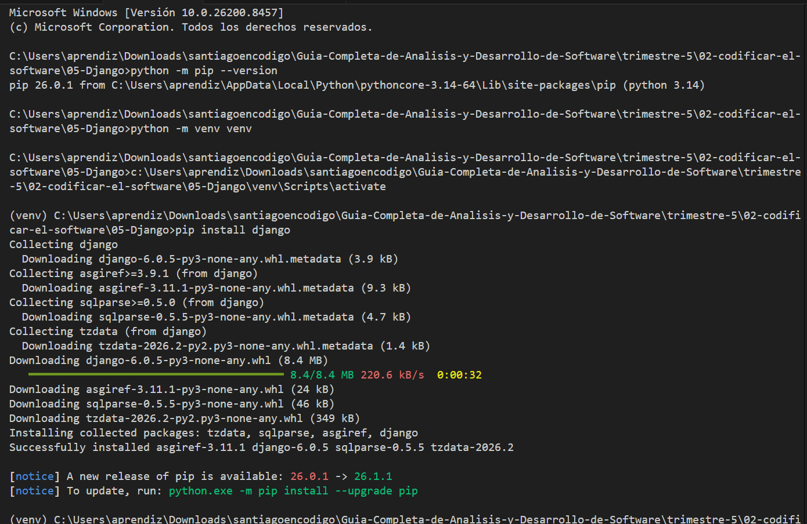
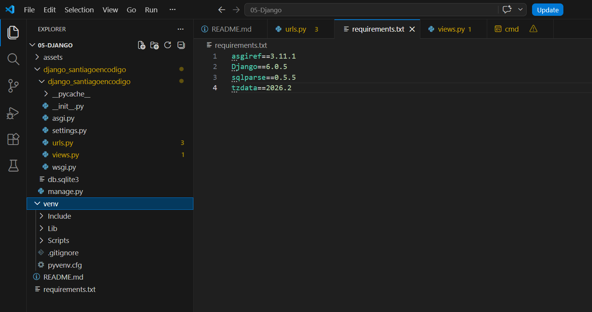
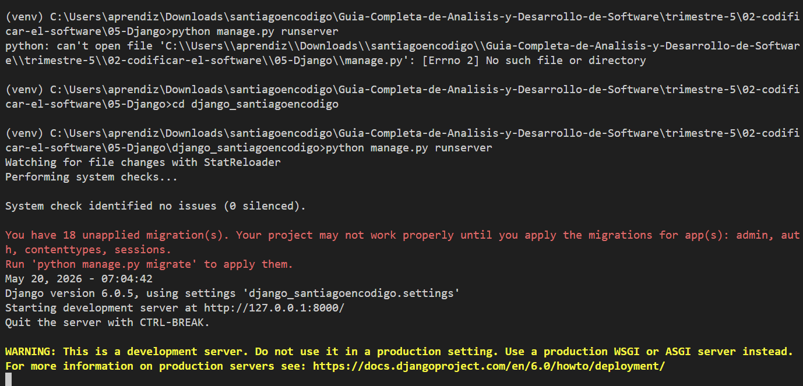
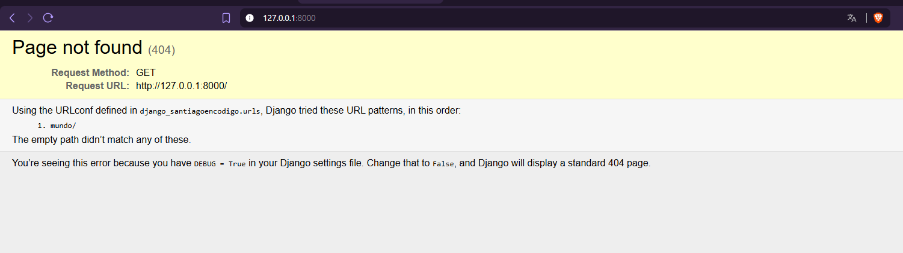
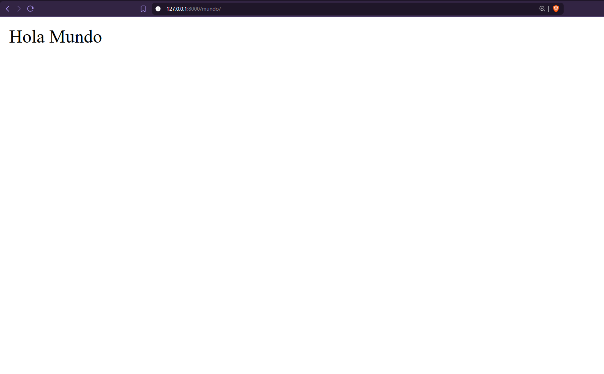
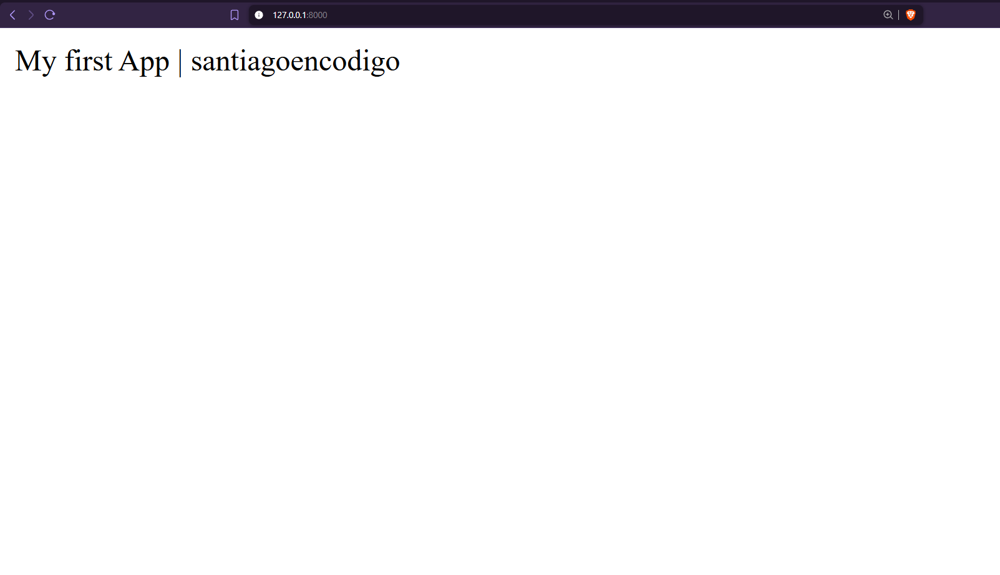
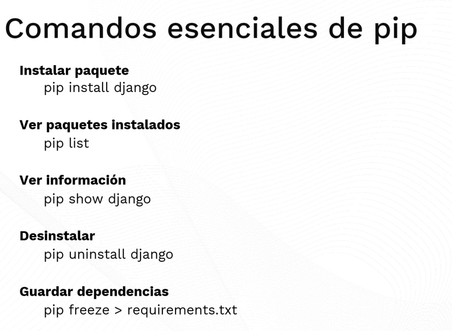
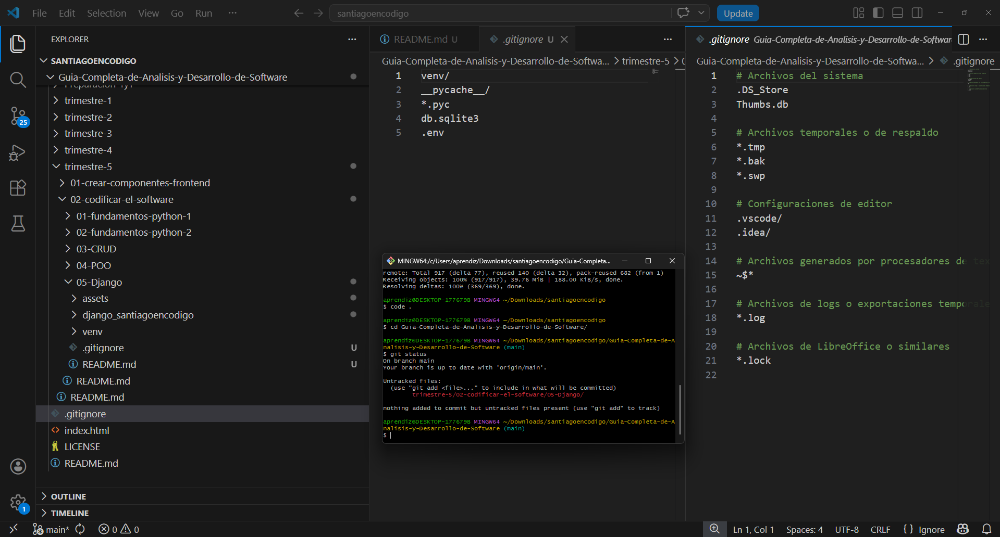

# Proyecto Django - ADSO

Este proyecto fue desarrollado como práctica de aprendizaje del framework Django durante el trimestre 5 del tecnólogo ADSO.


---


## Tabla de Contenido

[1. Instalación](#instalación)

[2. ¿Esto es sostenible para mi repositorio?](#esto-es-sostenible-con-mi-repositorio)

[3. Creación Hola Mundo](#creación-hola-mundo)

[4. Creación App](#creación-de-app)


---


## Instalación

1. Abrir VSCODE

2. Crear una carpeta que se puede llamar de cualquier forma.

3. Abrimos la terminal. (Verifica en la terminal estar en la dirección)

4. python -m pip --version (Verifica que halla python.)

5. python -m venv venv (Esto la preparación para instalar las dependencias que se requieren.)

6. Si no esta activo, tiene que escribir venv\Scripts\activate.bat   

> Es importante estar en el CMD y no en el powershell por temas de permisos. (COMMAND PROMPT)

> Tuve que cerrar la carpeta de mi repositorio y abrir directamente esta carpeta para trabajar.

    

Entonces ya podemos hacer la instalación:

7. pip install django

> la powershell es lo más cercano a la parte administrativa del equipo.

> Necesitamos pip para poder descargar las dependencias.

> Luego generamos el entorno virtual en donde se van a instalar las dependencias

> La primera dependencia que se instala es el framework de django.


---

## ¿Esto es Sostenible con mi Repositorio?

Lo importante ahora no es solo que funcione (Lo que estamos estudiando ahora), sino que el repositorio sea:

* limpio
* sostenible
* fácil de entender
* reutilizable para futuros trimestres/proyectos

Lo primero a corregir en este momento, es que no debo subir la carpeta **venv/** porque pesa muchisimo debido a que contiene ejecutables, librerías, archivos temporales, dependencias del sistema.

* Esto no se sube nunca.

Entonces debo crear un .gitignore y que diga:

```
    venv/
    __pycache__/
    *.pyc
    db.sqlite3
    .env
```

En el momento que yo haga git add. Git va a ignorar el entorno virtual, cachés, compilados, bases de datos temporales.

> Asi mi repositorio quedará más profesional.

Como posiblemente seguiremos aprendiendo sobre Django, es conveniente entonces que por cada proyecto django que se valla a crear, cada uno tendra su venv propio y su archivo requirements.txt. Este archivo debe estar en la misma ubicación que la carpeta **venv**

Cada proyecto por lo general tiene distintas versiones, distintas librerias, distintas configuraciones.

Escribi pip freeze para mirar los requerimientos.

    'pip freeze > requirements.txt'

asgiref==3.11.1
Django==6.0.5
sqlparse==0.5.5
tzdata==2026.2



Pero… ¿y si el repositorio es gigante?

Ahí entra .gitignore.

GitHub NO subirá:

venv/
cachés  
temporales

Entonces aunque tengas 10 proyectos Django, el repositorio seguirá relativamente limpio.

Entonces:

* Se sube código fuente.

* Se sube archivo requirements.txt

* Se sube mi README y los templates que llegue a usar.

* Se suben las apps de Django

* Se suben las configuraciones.

Y asi entonces la proxima vez cuando hagamos un:

    git clone mirepositorio

Tenemos que escribir:

    python -m venv venv

Activarlo:

    venv\Scripts\activate

E instalar dependencias:

    pip install -r requirements.txt

Y finalmente ejecutar servidor:

    python manage.py runserver

---

Django NO vive dentro del repositorio.

El repositorio solamente guarda:

* instrucciones,

* código,

* dependencias listadas.


Y cada computador reconstruye el entorno usando:

    pip install -r requirements.txt

> Eso es desarrollo profesional real.

---


---


## Creación Hola Mundo

* El proyecto es algo general.

* Una app son modulos.

8. django-admin startproject [nombre_del_proyecto]

    Yo inicialmente le pondre django_santiagoencodigo

    Esto creara entonces la carpeta django_santiagoencodigo

    El primer ejercicio seria una hola mundo.

9. Crearemos el archivo que hará las acciones. **views.py**

En este documento importaremos:

```python
    from django.http import HttpResponse

    def hola_mundo(request):
        return HttpResponse("Hola Mundo")
```

10. Ahora en urls.py

```py
    from django.contrib import admin
    from django.urls import path
    from django_santiagoencodigo.views import hola_mundo 

    # Esto es el Path/Camino de la URL

    urlpatterns = [
        # path('admin/', admin.site.urls),

        # Asi es como llamaré la URL en el navegador.
        path('mundo/', hola_mundo),
    ]
```

11. Ahora toca dirigirse a la dirección de la carpeta de nuestro proyectoEscribir en la terminal: python manage.py runserver

> migrate habla del modelo de las bases de datos.



+ Empezamos a mirar los métodos get

+ control + c para apagar el servidor y salir.

Entonces veremos como aparece una dirección: http://127.0.0.1:8000/

Que estaremos usando el puerto 8000. Entonces podemos hacer click en este link o por otro lado copiar y pegarlo en el navegador de nuestra preferencia.



Y entonces en el navegador, agregaremos a la ruta /mundo



La forma mientras tanto de mostrar algo es atraves de la respuesta http.

* Oprimo control + c para cerrar y continuar con la terminal.

> Por practica se pide hacer otra estructura, otra cosa similar.


---


# Creación de App

Se pide escribir el siguente comando:

    python manage.py startapp projectApp

    python manage.py startapp projectApp

Ahora deben aparecer cosas nuevas, como una nueva carpeta projectApp, el archivo db.sqlite3

1. Vamos a dirigirnos a settings.py

Y se pide revisar las apps:

```python
    INSTALLED_APPS = [
        'django.contrib.admin',
        'django.contrib.auth',
        'django.contrib.contenttypes',
        'django.contrib.sessions',
        'django.contrib.messages',
        'django.contrib.staticfiles',
    ]
```

* Son las apps instaladas por defecto, que eventualmente estaremos viendo pues este framework se empieza a comunicar entre aplicaciones y acabamos de crear una. Despues de la coma, tenemos que agregar la aplicación dependendiendo de como la llamemos

```python
    INSTALLED_APPS = [
        'django.contrib.admin',
        'django.contrib.auth',
        'django.contrib.contenttypes',
        'django.contrib.sessions',
        'django.contrib.messages',
        'django.contrib.staticfiles',
        'projectApp' #Se agrego la aplicación que creamos.
    ]
```

**Esta aplicación puede ser cualquier objeto/entidad/tabla de nuestra BD**

En las URLS.py cuando usemos un panel adminsitrativo

```python

    from django.contrib import admin
    from django.urls import path, include
    from django_santiagoencodigo.views import hola_mundo 

    # Esto es el Path/Camino de la URL

    urlpatterns = [

        # Necesito un recurso que incluira todas de la app.
        # path('', include("projectApp.urls")),

        # Asi es como llamaré la URL en el navegador.
        # path('mundo/', hola_mundo),

        # Esto es el rutamiento.
        path('admin/', admin.site.urls),
        path('', include("projectApp.urls")),    
    ]
```

Ahora nos dirigimos a projectApp y crearemos el archivo urls.py

* Este modulo (interno) empieza a tener sus propias rutas.

```python
    # Tenemos que importar path para poder usarlo.
    from django.urls import path

    # Importaremos todo lo que tengas las views/funciones
    from . import views


    urlpatterns=[
        # Las URL que esto va a tener.  
            # Estamos viendo el "futuro" 
            # Esto ira a path, ira a la views a la función index.
        path('', views.index, name='index'),
    ]
```

Ahora iremos a projectApp/views.py

Inicialmente el documento esta como:

```python
    from django.shortcuts import render

    # Create your views here.
```

Y entonces crearemos una función index.


```python
    from django.shortcuts import HttpResponse

    def index(Request):
        return HttpResponse("My first App | santiagoencodigo")

    # Create your views here.
```

* Es diferente una vista a una view.

Ahora en nuestra carpeta principal/raiz ejecutaremos: python manage.py runserver

> En el navegador



Esta estructura de archivos es una arquitectura en donde se separan las vistas, el modelo, las funciones. Y aun en este momento no hemos interactuado con un template como tal porque hemos estado utilizando un Http que es como hacer un print rapido en el caso de Django.


---


## Proyecto Django: MVT

Se nos presenta una pagina de geeks para entender como funciona la estructura general de nuestro proyecto.

manage.py es el archivo que se usa para iniciar el servidor.

__init__.py: Estará los paquetes para el proyecto.

asgi.py: Son temas para servidores (Cosas externas), en este momento nuestro sv es el local.

settings.py: Información y ajustes de configuracion para la base de datos

urls.py: El enrutamiento de acuerdo a las situaciones que suceda con nuestro programa.

---

**¿Qué es pip?**

Todo lo que se necesita descargar se encuentra en:

https://pypi.org/



El archivo requirements.txt tendrá información y muchas librerias. Si en algún momento estoy en otro equipo, simplemente tengo que escribir:

pip install -r requirements.txt y el computador instalará todo lo que se necesite de acuerdo a este documento.

> Me pareció muy importante esto porque inicialmente esto era una duda en [Y si es sotenible para mi repositorio?](#esto-es-sostenible-con-mi-repositorio)

---

**¿Qué es un entorno virtual?**

Fue lo que estuvimos haciendo, un entorno virtual es una caja aislada para cada proyecto.

Cada proyecto django debe tener su propio entorno.

---

**.gitignore**

El .gitignore, es importante aqui para cosas que no tengan que ser publicas y aunque sea privado, es importante que no se vean algunas cosas.

No solo por la seguridad, sino porque puede llegar a ser muy pesado.

> Podemos literalmente quedar tomandonos un cafe.

Por ejemplo:

venv: El entorno virtual que pesa mucho y no quiero que se suba.

__pycache__ tambien es información temporal.

.pyc archivos temporales

.env guarda secretos como passwords, tokkens y demás.

* Podemos entonces crearlo manualmente en la carpeta raiz

* Podemos escribir en la terminal echo. > .gitignore (Donde dentro estan todos los proyectos.)

Ya esta hecho el archivo, ¿Ahora qué debemos colocar aqui?

    Ignore:

    Entorno:
        venv/   

    Bases de Datos (Aun no tenemos):
        db.sqlite3

> En teoria ya podemos probar hacer un commit.



Algo que me tranquiliza, le pedí a chatgpt que analizará antes de yo ejecutar un commit:

    by chatgpt.com:

    Algo importante sobre tu .gitignore

    Veo que tienes:

    .gitignore global del repositorio

    y otro posiblemente dentro de 05-Django.

    Eso está bien.

    De hecho es profesional